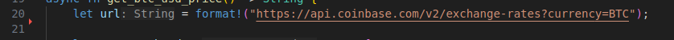
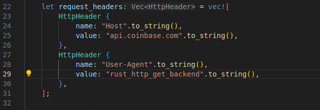
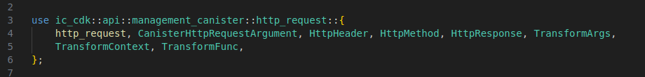
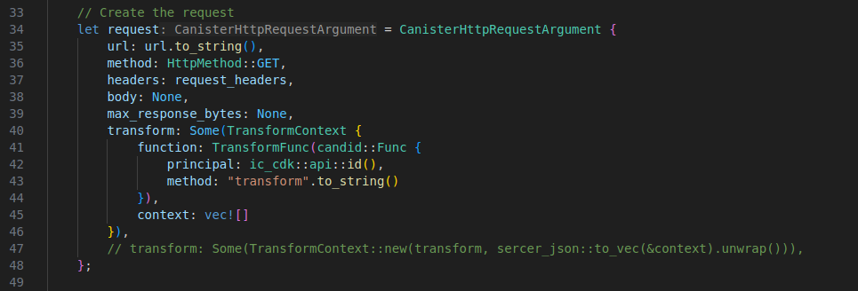

# RUST CANISTER HTTPS OUTCALLS - GET 
This canisters shows how to utilize canister HTTPs outcalls to make a call to ``api.coinbase.com`` to get the current exchange rates for ``BTC`` against ``KES`` and ``USD`` 

#### ``get_btc_usd_price`` Function: 
This is the main function that's making the HTTPs call. 

It first defines the URL for Coinbase API endpoint that provides exchange rates for BTC 

It then sets up the HTTP headers for the request. The ``Host`` and ``User-Agent`` headers are set 

It then sends teh HTTP request using the ``http_request`` function from the ``ic_cdk::api::management_canister::http_request`` module. The function is ``await`` because it is asyncronous 

The other section is for handling the HTTP response. If the request is succesfull ``Ok()``, it parses the response body from bytes to a ``String``, then parses the JSON string into a ``serde_json::Value``. It then accesses the "KES" and "USD" fields from the parsed JSON and returns a formatted string containing the exchange rates. If the request fails ``Err``, it returns a string describing the error. 

### ``transform`` Function: 
This function takes in the HTTP response as input and returns the transformed data. 
